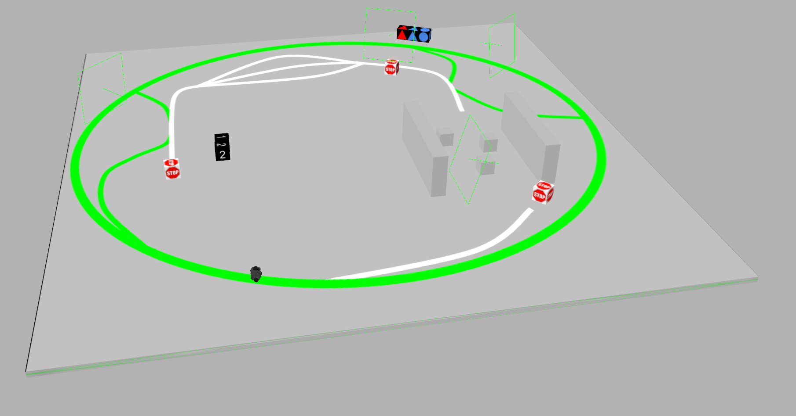
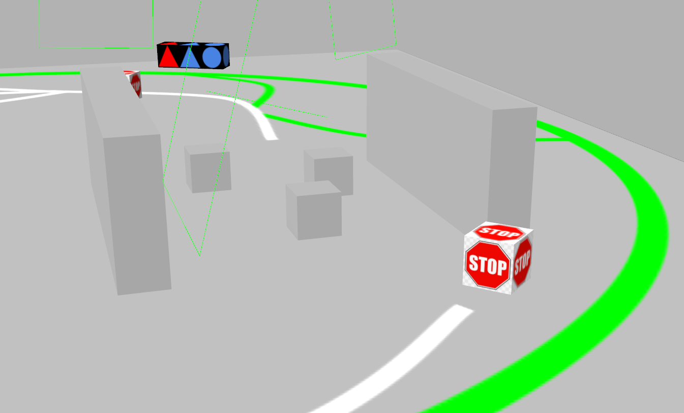
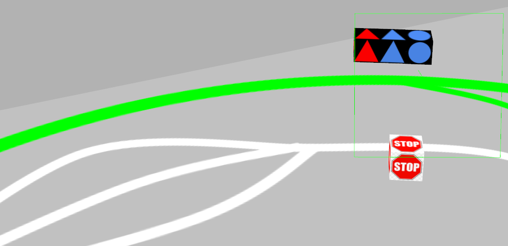
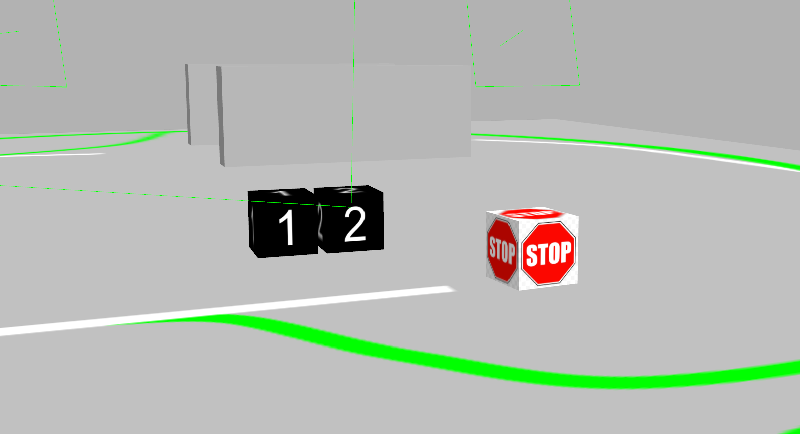

# CMPUT 412/503 - Winter 2022 - Competition #1
### Due Date: March 9th 
> [**Documentation**](https://docs.google.com/document/d/1ZLdbcUXxwFfg0cCSg30NjCK9X_XjVN-QozI6xW4F3Es/edit?usp=sharing) <br>
> [**Marking Scheme**](https://docs.google.com/spreadsheets/d/1XcLfa6rcBFukzsxgxVMo8MOfbVji45i9/edit?usp=sharing&ouid=100777847744389857699&rtpof=true&sd=true)

This competition will put together everything you’ve learned so far in this course: kinematics, ROS basic and OpenCV. The competition will be challenging, so we recommend starting early!

### Installing lab package
```
cd ~/catkin_ws/src

git clone <repo-url>

cd ~/catkin_ws && catkin_make
source ~/catkin_ws/devel/setup.bash
```

### Launching world and turtlebot
> `roslaunch comp_1 course_1.launch` <br>
> `roslaunch comp_1 course_2.launch` <br>
> `rpslaunch comp_1 rviz.launch`

# Procedure
You will be able to work on this competition alone, or in groups of two or three. Please register below:
* [**Sign Up for Group - CMPUT412-W22-Competition-1-Group**](https://docs.google.com/spreadsheets/d/1XDdUEKoQcOOBOQjQ9jkz2-KBoaWz-gs1efpWcF7cEyw/edit?usp=sharing)

**We provide two test world files. We encourage you to modify these world files to cover all the possible edge cases. ( All models you need in the folder ``worlds/`` )**

On competition day join your usual CMPUT 412 lab where the TAs will be in breakout rooms. We will send you a **new, previously unseen** world file to run your robot on. We will score your robot on this world, then you will be given 30 minutes to make any last minute changes to your code. At this point, please submit any final changes to Github. Then, we will run your robot again on another new world file. Your group's score will be whichever of these two runs had the highest score.

# Description
The competition consists of a course with 3 tasks along the way. The goal is to successfully complete the course while finishing as many of the tasks as possible and optimizing your turtlebot for speed. Figure 1 shows the overall layout of the course. Your turtle bot will start where the robot is placed in Figure 1. The green line is a “highway” around the course. You can choose to follow this line if you wish to skip one or more tasks. Otherwise, the white/gray line will take your robot directly from task to task. Stop signs will indicate when your robot needs to stop and decide whether to perform a task or transition to the green line if you wish to skip it. 
<br><br>
*Figure 1. Overall course layout*

## Task 1: Obstacle Detection
To start, your robot must navigate through a region containing a number of boxes, placed randomly. Your robot should successfully maneuver through this region without hitting any boxes. There are walls enclosing the region, so your robot cannot simply go around them. The line resumes approximately 4m ahead of where it left off before the boxes. Once escaping the box region, your robot should continue along this line to the next task. 
<br><br>
*Figure 2. Obstacle Detection*

## Task 2: Shape and Colour
The next task will require you to recognize the shape and colour of objects. Proceed along the line until the stop sign. Immediately to the right will be 3 coloured shapes. Two of them will be the same colour and two of them will be the same geometric shape (e.g. triangle, circle). Your task is to determine which shape is both the same colour as another and has the same geometric shape. Then, using the position of this shape, transition to the corresponding line. 

For example, suppose the shapes are (from left to right) red triangle, blue triangle, red circle. Since the red triangle matches another shape in terms of geometry (the blue triangle) and another in terms of colour (the red circle), the red triangle is the shape that determines which line the robot should transition to. The red triangle is in the leftmost position of the shapes, so the robot should follow the leftmost line to the next task.
<br><br>
*Figure 3. Shape and Colour*

## Task 3: Number Recognition
Immediately to the left of the end of the line are two boxes. Each box has a number from 1 to 9. The left box gives an x position and the right box gives a y position.  Your robot must move to this (x,y) position in the global frame without hitting any obstacles.
<br><br>
*Figure 4. Number Recognition*

# Marking
This competition will use a score-based system for assigning rankings. You will gain scores for successfully completing tasks. Additionally, there will be scores awarded for the 3 fastest teams completing each task (You need to successfully complete tasks). The scoring breaks down as this file - [**Mark-Schema-412-W22-Competition-1**](https://docs.google.com/spreadsheets/d/1XcLfa6rcBFukzsxgxVMo8MOfbVji45i9/edit?usp=sharing&ouid=100777847744389857699&rtpof=true&sd=true).

**Warning:** If you try to **Hard Code** some task, we will lower scores for you and your team.<br>
> Hard Code Example:
* Task 1 - Design a route through the area based on the location of the boxes without using laser scan.
* Task 2 - Typed the answer based on the world file without using OpenCV to identify the shapes and colours.
* Task 3 - Typed the answer based on the world file; The turtlebot teleports to the destination by modifying the position or reset function.

# Resources
We do not require that your robots adhere to any specific implementation. However, we do require that you cite any code that you may find on the internet.

Your robot controllers will be significantly more complex than the controllers for the labs. SMACH ([http://wiki.ros.org/smach](http://wiki.ros.org/smach)) is an architecture that can be used to implement state machines. This might make your controllers easier to implement. Note: you are not required to use SMACH.

You may find OpenCV contours useful for shape detection:
* [https://docs.opencv.org/3.4/d4/d73/tutorial_py_contours_begin.html](https://docs.opencv.org/3.4/d4/d73/tutorial_py_contours_begin.html)
* [https://docs.opencv.org/3.4/da/d53/tutorial_py_houghcircles.html](https://docs.opencv.org/3.4/da/d53/tutorial_py_houghcircles.html)

